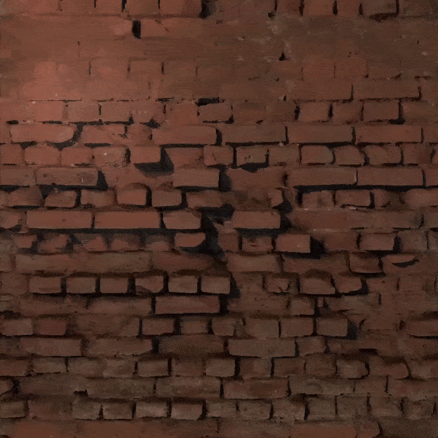
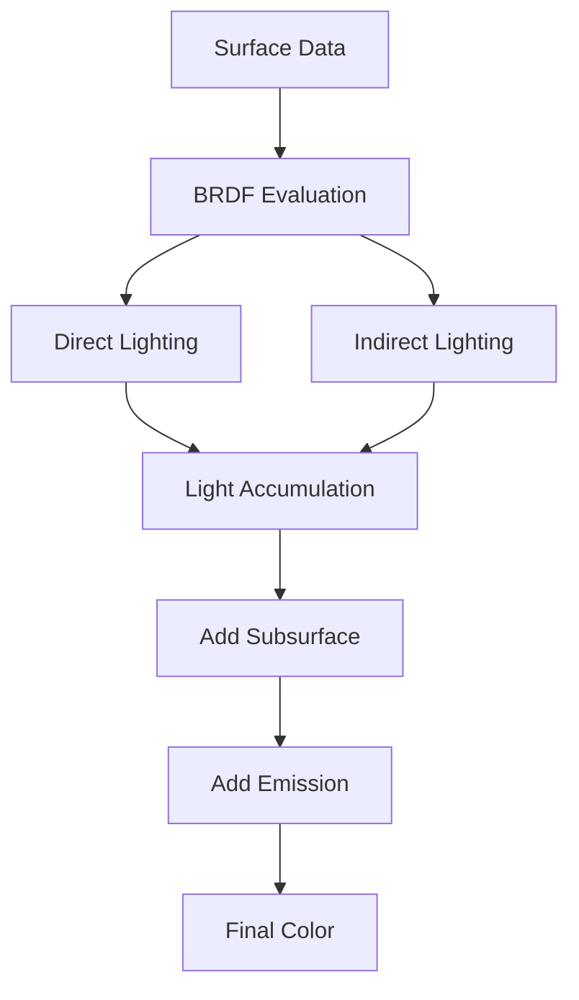
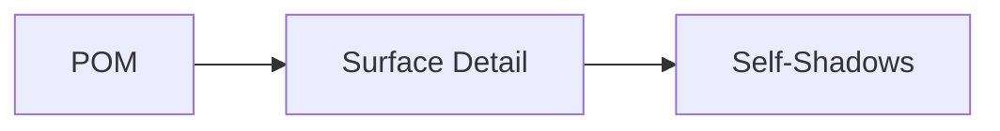

# PBR GGX Shader (Unity BRP)

<div align="center">
  
</div>

## Summary
A physically-based rendering (PBR) shader with GGX BRDF implementation for Unity's Built-in Render Pipeline (BRP). Designed primarily for forward rendering but compatible with deferred (stored in Forward draw pass).

## Features
⚠️ This explanation uses more general language in terms of both the formula and the shader implementation.

### 1. Core PBR Implementation
- **GGX Microfacet Distribution**: Accurate specular highlights with energy conservation
- **Smith Visibility Term**: Height-correlated masking-shadowing
- **Schlick Fresnel**: With exact Fresnel calculation for dielectrics
- **Disney Diffuse**: Energy-preserving diffuse term
- **Metallic Workflow**: With dielectric F0 control (default 0.04)
- **Linear Space Lighting**: Proper gamma correction

#### 1. Rendering Equation Implementation
The shader implements a modified version of the rendering equation:

```math
L_o(\mathbf{v}) = \int_\Omega \left[ \underbrace{f_d(\mathbf{l},\mathbf{v})}_{\text{Diffuse}} + \underbrace{f_r(\mathbf{l},\mathbf{v})}_{\text{Specular}} \right] L_i(\mathbf{l}) (\mathbf{n} \cdot \mathbf{l}) d\omega_i + \underbrace{L_{sss}}_{\text{Subsurface}} + \underbrace{L_{emit}}_{\text{Emission}}
```

**Shader Implementation**:
```hlsl
// In LightingCustomPBR() function:
half3 directColor = (diffuse + specular) * lightColor * NdotL;
half3 indirectColor = (indirectDiffuse + indirectSpecular) * occlusion;
half3 subsurfaceColor = CalculateSubsurfaceScattering(...);
return directColor + indirectColor + subsurfaceColor + emission;
```

#### 2. Microfacet BRDF Components

##### Normal Distribution Function (GGX)
```math
D(\mathbf{h}) = \frac{\alpha^2}{\pi[(\mathbf{n} \cdot \mathbf{h})^2(\alpha^2-1)+1]^2}
```
**Shader Implementation**:
```hlsl
// In D_GGX() function:
half a = roughness * roughness;
half a2 = a * a;
half NdotH2 = NdotH * NdotH;
half denom = (NdotH2 * (a2 - 1.0) + 1.0);
return a2 / (UNITY_PI * denom * denom);
```

##### Geometry Function (Smith-SchlickGGX)
```math
G(\mathbf{v},\mathbf{l}) = \frac{\mathbf{n} \cdot \mathbf{v}}{(\mathbf{n} \cdot \mathbf{v})(1-k)+k} \cdot \frac{\mathbf{n} \cdot \mathbf{l}}{(\mathbf{n} \cdot \mathbf{l})(1-k)+k}
```
where `k = (α+1)²/8`

**Shader Implementation**:
```hlsl
// In G_Smith() function:
half k = (roughness + 1.0);
k = (k * k) / 8.0;
return G_SchlickGGX(NdotV, k) * G_SchlickGGX(NdotL, k);
```

#### 3. Fresnel Reflectance

##### Schlick Approximation
```math
F(\mathbf{v},\mathbf{h}) = F_0 + (1-F_0)(1-(\mathbf{v} \cdot \mathbf{h}))^5
```

**Shader Implementation**:
```hlsl
// In F_Schlick() function:
return F0 + (1.0 - F0) * pow(1.0 - cosTheta, 5.0);
```

##### Exact Dielectric Fresnel
```math
F_{dielectric} = \frac{1}{2}\left(\left(\frac{n_2\cosθ_i-n_1\cosθ_t}{n_2\cosθ_i+n_1\cosθ_t}\right)^2 + \left(\frac{n_1\cosθ_i-n_2\cosθ_t}{n_1\cosθ_i+n_2\cosθ_t}\right)^2\right)
```

**Implementation Note**:
Used for accurate dielectric materials (glass, water) when `metallic=0`

#### 4. Energy-Conserving Diffuse (Disney)

```math
f_d = \frac{baseColor}{\pi} \cdot (1+(F_{d90}-1)(1-(\mathbf{n} \cdot \mathbf{l}))^5) \cdot (1+(F_{d90}-1)(1-(\mathbf{n} \cdot \mathbf{v}))^5)
```

**Shader Implementation**:
```hlsl
// In Fd_Disney() function:
half Fd90 = 0.5 + 2.0 * LdotH * LdotH * roughnessSq;
half lightScatter = (1.0 + (Fd90 - 1.0) * pow(1.0 - NdotL, 5.0));
half viewScatter = (1.0 + (Fd90 - 1.0) * pow(1.0 - NdotV, 5.0));
return lightScatter * viewScatter;
```

### 5. Complete Light Integration

**Final Shader Computation Flow**:
1. **Direct Lighting**:
   ```math
   L_{direct} = \underbrace{(k_d \cdot f_d + f_r)}_{\text{BRDF}} \cdot E_i \cdot (\mathbf{n} \cdot \mathbf{l})
   ```

2. **Indirect Lighting**:
   ```math
   L_{indirect} = \underbrace{k_d \cdot \frac{baseColor}{\pi} \cdot E_{diffuse}}_{\text{Diffuse IBL}} + \underbrace{k_s \cdot E_{specular}}_{\text{Specular IBL}}
   ```

3. **Special Effects**:
   ```math
   L_{final} = (L_{direct} + L_{indirect} \cdot occlusion) + L_{sss} + L_{emit}
   ```

**Shader Code Flow**:


---

### 2. **Parallax Occlusion Mapping (POM)**
- **Raymarching Implementation**: 16 default samples with 4 refinement steps
- **Self-Shadowing**: Optional shadow casting from height map
- **Adaptive Sampling**: Adjustable sample count and refinement
- **Texture Gradients**: Correct mipmap selection using ddx/ddy
- **Threshold Control**: Fine-tune shadow detection sensitivity

#### 1. POM Implementation
**Raymarching Equation**
```math
\begin{aligned}
&\mathbf{uv}_{n+1} = \mathbf{uv}_n + \Delta\mathbf{uv} \cdot \frac{h_{step}}{H_{scale}} \\
&\text{where } \Delta\mathbf{uv} = \frac{\mathbf{V}_{ts.xy}}{||\mathbf{V}_{ts}||} \cdot \frac{1}{N_{samples}} \\
&h_{step} = \frac{1}{N_{samples}} \quad \text{(uniform height steps)}
\end{aligned}
```

**Shader Implementation**:
```hlsl
// In surf() function:
float2 uvStep = -((viewDir.xy * _Parallax) * (1.0/_POMSamples));
float currentHeight = 1.0 - (1.0/_POMSamples);
for(int i=0; i<_POMSamples; i++) {
    float sampledHeight = tex2Dgrad(_ParallaxMap, currentUV, ddx_uv, ddy_uv).r;
    if(sampledHeight > currentHeight) {
        // Binary search refinement
        ...
    }
    currentHeight -= (1.0/_POMSamples);
    currentUV += uvStep;
}
```

#### Binary Search Refinement
```math
\mathbf{uv}_{refined} = \underset{\mathbf{uv}}{\text{argmin}} \left( |h_{map}(\mathbf{uv}) - h_{ray}(\mathbf{uv})| \right)
```

**Shader Implementation**:
```hlsl
for(int k=0; k<_POMRefinementSteps; k++) {
    float2 midUV = (frontUV + backUV) * 0.5;
    float midHeight = tex2Dgrad(_ParallaxMap, midUV, ddx_uv, ddy_uv).r;
    if(midHeight > currentHeight) {
        backUV = midUV;
    } else {
        frontUV = midUV;
    }
}
```

#### 2. Self-Shadowing Implementation

```math
\begin{aligned}
&\text{Shadow Factor} = 1 - I_{shadow} \cdot \sum_{j=1}^{N_{shadow}} \mathbb{I}(h_{map}(\mathbf{uv}_j) > h_{ray}(\mathbf{uv}_j) + \epsilon) \\
&\mathbf{uv}_j = \mathbf{uv}_{final} + j \cdot \Delta\mathbf{uv}_{light} \\
&\Delta\mathbf{uv}_{light} = \frac{\mathbf{L}_{ts.xy}}{||\mathbf{L}_{ts}||} \cdot \frac{H_{scale}}{N_{shadowSamples}}
\end{aligned}
```

**Shader Implementation**:
```hlsl
float shadow = 1.0;
for(int j=1; j<_POMShadowSamples; j++) {
    shadowUV += shadowUVStep;
    float shadowHeight = tex2Dgrad(_ParallaxMap, shadowUV, ddx_uv, ddy_uv).r;
    if(shadowHeight > currentHeight + _POMShadowThreshold) {
        shadow = 1.0 - _POMShadowIntensity;
        break;
    }
}
```

### 3. Technical Considerations

| Parameter | Mathematical Symbol | Effect |
|-----------|---------------------|--------|
| `_Parallax` | \( H_{scale} \) | Maximum height displacement |
| `_POMSamples` | \( N_{samples} \) | Primary ray steps quality |
| `_POMRefinementSteps` | \( N_{refine} \) | Intersection precision |
| `_POMShadowThreshold` | \( \epsilon \) | Depth bias for shadow acne |

**Performance**:
```math
\text{Cost} = O(N_{samples} + N_{refine} + N_{shadow} \cdot \mathbb{I}_{shadowEnabled})
```

**Shader Code Flow**:


⚠️ Please use tight or low sample counts for POM and self-shadowing to improve performance.

---

### 3. **Subsurface Scattering (SSS)**
- **Diffusion Profile Approximation**: Using 3-term kernel (RGB channels)
- **Thickness Map**: Controls light penetration distance
- **Scatter Radius**: Adjustable falloff (0-5 units)
- **Energy Conservation**: Reduces albedo where scattering occurs

#### Subsurface Scattering Implementation

##### Diffusion Profile
```math
L_{sss} = \sum_{i=1}^3 kernel_i \cdot \frac{transmission \cdot scatter}{1+(\mathbf{l} \cdot \mathbf{h}_{sss})^2(\alpha^2-1)}
```

**Shader Implementation**:
```hlsl
// In CalculateSubsurfaceScattering():
half3 H = normalize(lightDir + normal * _SubsurfaceRadius);
half scatter = 1.0 / (1.0 + (dotLH * dotLH) * (roughnessSq - 1.0));
half transmission = pow(saturate(1.0 - NdotL), _SubsurfaceRadius) * thickness;
```

---

### 4. **Specular Anti-Aliasing (Toksvig)**
<div align="center">
  
</div>
- **Normal Map Filtering**: Mipmap selection based on roughness and screen-space derivatives
- **Roughness Modulation**: Reduces specular aliasing artifacts only for metal surface

#### 1. Normal Variance Calculation

```math
\begin{aligned}
&\sigma_n^2 = \frac{||\nabla n||^2}{1 - ||\mathbf{\bar{n}}||^2} \\
&\text{where } \nabla n = \left( \frac{\partial n}{\partial x}, \frac{\partial n}{\partial y} \right) \text{ (screen-space derivatives)}
\end{aligned}
```

**Shader Implementation**:
```hlsl
float2 duv_dx = ddx(uv);
float2 duv_dy = ddy(uv);
float mip = 0.5 * log2(max(dot(duv_dx, duv_dx), dot(duv_dy, duv_dy)));
```

#### 2. Roughness Modulation

```math
\alpha' = \frac{\alpha}{\sqrt{1 + \sigma_n^2 \cdot \alpha^2}}
```

**Shader Implementation**:
```hlsl
mip += roughnessValue * roughnessValue * 4.0;
float4 normal_low = tex2Dlod(_NormalMap, float4(uv, 0, floor(mip)));
float4 normal_high = tex2Dlod(_NormalMap, float4(uv, 0, ceil(mip)));
packedNormal = lerp(normal_low, normal_high, frac(mip));
```

#### 3. Adaptive MIP Selection

```math
LOD = \frac{1}{2}\log_2\left(\max(||\nabla u||^2, ||\nabla v||^2)\right) + 2\alpha^2
```

**Graphics Pipeline Impact**:
- Reduces specular aliasing while preserving detail
- Maintains texture coherence across pixels
- Adapts to both distance and roughness

⚠️ Please use this only on metal surfaces that exhibit high specularity; using it on other surfaces may introduce more noise or even eliminate some specular highlights

---

### 5. **Cutout Transparency**
- **Alpha Testing**: With optional opacity map channel
- **Shadow Support**: Proper shadow caster pass implementation

---

### 6. Additional Features
- **Emission**: HDR color support with intensity control
- **Occlusion Mapping**: Ambient occlusion support
- **Double-Sided Rendering**: With proper normal flipping
- **Optimized Shader Variants**: Feature toggles via shader_feature

---

## Limitations
1. **No Deferred Material Support**: Renders in Forward pass even in Deferred
2. **No Screen Space Reflections**: Incompatible with post-process SSR
   - SSR and other G-buffer based post-processing effects are not compatible, as this shader renders in the Forward Base path, even under Deferred settings.
3. **BRP Only**: Not compatible with URP/HDRP

## Sample Scene
The repository includes a demonstration scene showing:
- Material variations, including metallic and diffuse
- POM height mapping examples
- SSS effect on material

## License
This project is licensed under the MIT License.
Use it freely for learning, modification, or integration into your own experiments.
