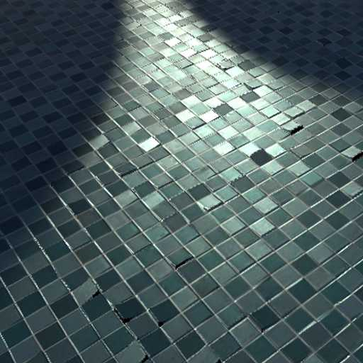

# PBR GGX Shader (Unity BRP)

⚠️ This version has been deprecated. Please use this version for the latest update: [Ymne LightingFX](https://github.com/Ymne22/YmneLightingFX-for-Unity-BRP/tree/main)

## Summary
A physically-based rendering (PBR) shader with GGX BRDF implementation for Unity's Built-in Render Pipeline (BRP). Designed primarily for forward rendering but compatible with deferred (stored in Forward draw pass).

## Features
### 1. Core PBR Implementation

  

- **GGX Microfacet Distribution**: Accurate specular highlights with energy conservation
- **Smith Visibility Term**: Height-correlated masking-shadowing
- **Schlick Fresnel**: With exact Fresnel calculation for dielectrics
- **Disney Diffuse**: Energy-preserving diffuse term
- **Metallic Workflow**: With dielectric F0 control (default 0.04)
- **Linear Space Lighting**: Proper gamma correction

**Shader Code Flow**:

---
### 2. **Parallax Occlusion Mapping (POM)**

  

- **Raymarching Implementation**: 16 default samples with 4 refinement steps
- **Self-Shadowing**: Optional shadow casting from height map
- **Adaptive Sampling**: Adjustable sample count and refinement
- **Texture Gradients**: Correct mipmap selection using ddx/ddy
- **Threshold Control**: Fine-tune shadow detection sensitivity

⚠️ Please use tight or low sample counts for POM and self-shadowing to improve performance.

---

### 3. **Subsurface Scattering (SSS)**

  

- **Diffusion Profile Approximation**: Using 3-term kernel (RGB channels)
- **Thickness Map**: Controls light penetration distance
- **Scatter Radius**: Adjustable falloff (0-5 units)
- **Energy Conservation**: Reduces albedo where scattering occurs

---

### 4. **Specular Anti-Aliasing (Toksvig)**

  

- **Normal Map Filtering**: Mipmap selection based on roughness and screen-space derivatives
- **Roughness Modulation**: Reduces specular aliasing artifacts only for metal surface

⚠️ Please use this only on metal surfaces that exhibit high specularity using it on other surfaces may introduce more noise or even eliminate some specular highlights

---

### 5. **Cutout Transparency**
- **Alpha Testing**: With optional opacity map channel
- **Shadow Support**: Proper shadow caster pass implementation

---

### 6. Additional Features
- **Emission**: HDR color support with intensity control
- **Occlusion Mapping**: Ambient occlusion support
- **Double-Sided Rendering**: With proper normal flipping
- **Optimized Shader Variants**: Feature toggles via shader_feature

---

## Limitations
1. **No Deferred Material Support**: Renders in Forward pass even in Deferred
2. **No Screen Space Reflections**: Incompatible with post-process SSR
   - SSR and other G-buffer based post-processing effects are not compatible, as this shader renders in the Forward Base path, even under Deferred settings.
3. **BRP Only**: Not compatible with URP/HDRP

## Sample Scene
The repository includes a demonstration scene showing:
- Material variations, including metallic and diffuse
- POM height mapping examples
- SSS effect on material

## License
This project is licensed under the MIT License.
Use it freely for learning, modification, or integration into your own experiments.
